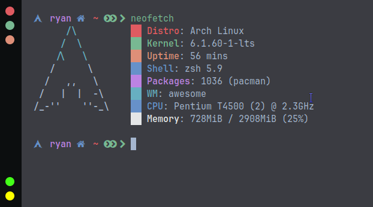

<div align="center">
     <h1>Awesome Dotfiles Arch</h1>
 </div>

<div align=center>

<a href="https://awesomewm.org/"></a>

<div align="center">
    
    
</div>

</div>

## 🔥 Information



|    Distro    |                          [Archlinux](https://archlinux.org/)                           |
| :----------: | :------------------------------------------------------------------------------------: |
|      WM      |                   [AwesomeWM](https://github.com/awesomeWM/awesome)                    |
|   Terminal   | [Alacritty](https://github.com/alacritty/alacritty)-[St](https://github.com/siduck/st) |
|    Shell     |                    [Oh My Zsh](https://github.com/ohmyzsh/ohmyzsh)                     |
|   Launcher   |                       [Rofi](https://github.com/davatorium/rofi)                       |
|  Clipboard   |                  [Rofi-Greenclip](https://github.com/erebe/greenclip)                  |
|  Compositor  |                                         Picom                                          |
| Music/Player |                                      MPD-Ncmpcpp                                       |
| File Manager |                                          nemo                                          |

## 🖼️ Gallery


## 💣 Setup Installation

1.- <b>First clone the repository</b>

```sh
https://github.com/hidayry/awesomewm-dotfiles.git
```

2.- <b>Copy config :</b>

- **⚠️ WARNING: Configuration files may be overrided,please backup your config**

```sh
cd awesomewm-dotfiles
cp -r .config/* ~/.config/
cp -r .local/* ~/.local/
cp -r home/* ~/
```

3.- <b>Install Dependencies</b>

Dependencies :

```sh
sudo pacman -S --needed xorg-server unzip mpd mpc ncmpcpp nemo ttf-roboto polkit-gnome maim alsa-utils brightnessctl jq playerctl xdotool xdo redshift lxappearance-gtk3 python-mutagen dmenu rofi picom xautolock gvfs gvfs-mtp gvfs-ntfs alacritty
```

- **aur-packages**

```sh
yay -S --needed mpdris2 awesome-git greenclip networkmanager-dmenu-git i3lock-color tela-circle-icon-theme-manjaro material-gtk-theme-deepocean-git
```

- **For Fonts**

Extract fonts.zip in ~/.local/share/fonts than run fc-cache -fv in terminal

```sh
unzip fonts.zip -d ~/.local/share/fonts
fc-cache -fv
```

<table align="center">
   <tr>
      <th align="center">
      </th>
   </tr>
   <tr>
      <td align="center">

    💻 Dotfiles Configured at 1360x768 with 96 DPI on 1 monitor

   </tr>
   </table>

## Credits

[adi1090x](https://github.com/adi1090x/rofi), [rxyhn](https://github.com/rxyhn/yoru), [saimoomedits](https://github.com/saimoomedits/dotfiles), [AlphaTechnolog](https://github.com/AlphaTechnolog),[Chick2D](https://github.com/Chick2D/neofetch-themes)
